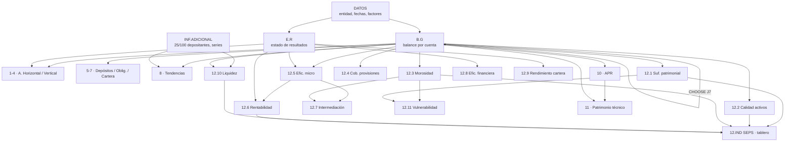

# 07b · Excel HAF_CRDIAMIGO — Datos y modelo

> Auditoría de `HAF_CRDIAMIGO_febrero_25.xlsm` (Herramienta de Análisis Financiero, entidad
> **COAC CREDIAMIGO LTDA.**, segmento 2). Solo lectura sobre una copia descifrada en carpeta temporal.
> Marcas: ✅ verificado · 📘 fórmula estándar por validar con negocio · ❓ desconocido.

## 1. Resumen

- Libro macro-habilitado (`.xlsm`), **23,3 MB descifrado**, originalmente **cifrado con contraseña de apertura** (AES).
- **28 hojas** (4 ocultas), **2.756 fórmulas**, **45.921 celdas con contenido**, **29 gráficos**
  (15 barras, 11 pastel 3D, 3 líneas), VBA de **429 KB** (solo navegación), **sin** Power Query,
  **sin** tablas dinámicas, **sin** conexiones externas. ✅
- Modelo **mono-entidad, mono-corte**: un solo balance (`B.G`) y un solo estado de resultados (`E.R`)
  alimentan todo. El corte se elige con un selector de período (`B.G!$J$7` / `$M$7`) vía `CHOOSE(...)`. ✅
- Entidad y parámetros en `DATOS`: `E10`=COAC CREDIAMIGO LTDA., `E12`=segmento 2, `E14`=45716 (≈28/02/2025),
  `E16`=45627 (base de comparación, ≈30/11/2024), `E22`=13 (meses del ejercicio), `E24`=3 (mes de análisis). ✅
- El libro **replica los indicadores financieros de la SEPS** (hojas `12.x`) a partir de las cuentas del
  balance, con el patrón `CONCEPTO → FÓRMULA → DESARROLLO → RESULTADO` y `VLOOKUP` por código de cuenta. ✅

## 2. Mapa de hojas

| # | Hoja | Tipo | Visible | Celdas | Fórm. | Errores¹ | Propósito |
|---|---|---|---|---:|---:|---:|---|
| 1 | `INDICE` | navegación | sí | 1 | 1 | 0 | Portada con botones (VBA) |
| 2 | `DATOS` | **entrada** | sí | 18 | 1 | 0 | Nombre, segmento, fechas, factores de anualización |
| 3 | `B.G` | **entrada/cálculo** | sí | 28.648 | 499 | **5.001** | Balance a nivel de cuenta (filas 13–965) + matriz de períodos `CHOOSE` |
| 4 | `E.R` | **entrada/cálculo** | sí | 11.732 | 115 | 160 | Estado de resultados a nivel de cuenta (filas 8–205) |
| 5 | `INF.ADICIONAL` | entrada | sí | 106 | 5 | 0 | 25/100 mayores depositantes y series para tendencias (valores fijos) |
| 6 | `1.BG A.HOR` | salida | sí | 216 | 103 | 0 | Balance — análisis horizontal (variación absoluta/relativa) |
| 7 | `2.ER A.HOR` | salida | sí | 146 | 62 | 0 | Resultados — análisis horizontal |
| 8 | `3.BG A.VERT` | salida | sí | 248 | 137 | 0 | Balance — análisis vertical (estructura %) |
| 9 | `4.ER A.VERT` | salida | sí | 232 | 92 | 0 | Resultados — análisis vertical |
| 10 | `5.DEPOSITOS ` | salida | sí | 201 | 82 | 0 | Obligaciones con el público: variación y composición |
| 11 | `6.OBLIGACIONES FINANCIERAS` | salida | sí | 239 | 148 | 0 | Obligaciones financieras: variación, composición, maduración |
| 12 | `7.CARTERA` | salida | sí | 723 | 403 | 0 | Cartera: variación, composición y maduración por segmento |
| 13 | `8.A.TEND` | salida | sí | 86 | 70 | 0 | Tendencias de activo/pasivo/patrimonio y tasas de crecimiento |
| 14 | `12.IND SEPS` | salida | sí | 156 | 56 | 8 | Tablero resumen de indicadores SEPS + **promedios de segmento (fijos, 2016)** |
| 15 | `12.1.SUF. PATR` | cálculo | sí | 256 | 81 | 0 | Suficiencia patrimonial |
| 16 | `12.2.CAL ACT` | cálculo | sí | 341 | 109 | 1 | Calidad de activos |
| 17 | `12.3.MOROSIDAD` | cálculo | sí | 893 | 268 | 0 | Morosidad por segmento y total |
| 18 | `12.4.C. PROV` | cálculo | sí | 281 | 89 | 0 | Cobertura de provisiones |
| 19 | `12.5.E.MICRO` | cálculo | **oculta** | 133 | 46 | 10 | Eficiencia microeconómica (base de promedios de activo) |
| 20 | `12.6.RENTAB` | cálculo | **oculta** | 83 | 33 | 9 | Rentabilidad (ROA/ROE) |
| 21 | `12.7.INTERM FINANCIERA` | cálculo | sí | 37 | 12 | 0 | Intermediación financiera |
| 22 | `12.8.E.FINAN` | cálculo | **oculta** | 140 | 49 | 7 | Eficiencia financiera (margen) |
| 23 | `12.9.RENDIMIENTO CARTERA` | cálculo | **oculta** | 200 | 63 | **24** | Rendimiento de cartera por segmento |
| 24 | `12.10.LIQUIDEZ` | cálculo | sí | 197 | 67 | 0 | Liquidez y cobertura de 25 mayores depositantes |
| 25 | `12.11.VULNERABILIDAD` | cálculo | sí | 143 | 41 | 0 | Vulnerabilidad del patrimonio y FK |
| 26 | `9.EST COSTOS` | cálculo | sí | 213 | 52 | **39** | Determinación de costos por subcuenta |
| 27 | `10.REQ APR` | cálculo | sí | 111 | 35 | 0 | Activos y contingentes ponderados por riesgo (APR) |
| 28 | `11.PAT.TECNICO` | cálculo | sí | 141 | 37 | 0 | Patrimonio técnico primario y secundario |

¹ Errores en caché (`#DIV/0!`, `#REF!`, `#N/A`, …) detectados en los valores guardados.

### 2.1 Diagrama de dependencias

## 3. Variables por tipo de tabla

- **`DATOS` (parámetros):** nombre de entidad (texto), segmento (número), dos fechas de corte (serial de
  Excel), `VALORES` (texto "En USD"), y dos contadores de meses (`E22`=13, `E24`=3) usados como **factor de
  anualización** `×E22/E24`. ✅
- **`B.G` (balance):** `B`=código de cuenta, `C`=descripción, `D`/`E`=cifras del corte y comparación
  (traídas con `VLOOKUP` desde la matriz de períodos), más columnas `S:BU` con los 12+ cortes mensuales que
  el selector `CHOOSE($J$7,…)` escoge. Rango de filtro `B.G!$B$12:$E$965`. Unidad: USD. ✅
- **`E.R` (resultados):** misma estructura (`C`=código, `D`/`E`=cifras). Rango `E.R!$C$8:$F$205`. ✅
- **Hojas de indicadores `12.x`:** bloque `CONCEPTO` (texto), `FÓRMULA` (texto descriptivo), `DESARROLLO`
  (numerador/denominador con `VLOOKUP` a `B.G`/`E.R`) y `RESULTADO` (ratio, con guarda `IF(den=0,0,num/den)`). 📘
- **`INF.ADICIONAL`:** saldos de 25 y 100 mayores depositantes (valores fijos) y una serie histórica
  `Dic-12 … Dic-14` de activo/pasivo/patrimonio para tendencias. ✅

## 4. Catálogo de indicadores (muestra verificada)

| Indicador | Fórmula (Excel) | Celdas | Unidad | ¿Estándar? | Observación |
|---|---|---|---|---|---|
| Suficiencia patrimonial | (Patrimonio + Resultados) / Activos inmovilizados | `12.1!F16=IF(F13=0,0,F13/F14)` | ratio | 📘 | Numerador `=+G22+G24-G23`; denominador = cartera improductiva (`SUM`) |
| Morosidad total | Cartera improductiva / Cartera bruta | `12.3!F29`, …, total `F134/F135` | % | ✅ | Por 10 segmentos + total; guarda `IF(den=0,0,…)` |
| Cobertura de provisiones | Provisiones / Cartera improductiva | `12.4` por segmento | % | 📘 | |
| Calidad de activos (improd. netos/activo) | Act. improductivos netos / Total activo | `12.2!E14…` | % | ✅ | También productivos/activo y productivos/pasivos con costo |
| ROA | (Resultado / Activo promedio) × `E22/E24` | `12.6!F45`, `F48` | % | 📘 | **Anualización ×13/3** (ver §5.1) |
| ROE | (Resultado / Patrimonio promedio) × `E22/E24` | `12.6!F19`, `F22` | % | 📘 | Patrimonio promedio = `B.G!BU943`; **ajuste dic. roto** (`J33=B.G!#REF!`) |
| Intermediación | Cartera bruta / (Dep. vista + Dep. plazo) | `12.7!F17=IF(F14=0,0,F14/F15)` | % | ✅ | Denominador `@2101+@2103`, no todo `@21` |
| Liquidez | Fondos disponibles / Depósitos a corto plazo | `12.10!F15` | % | ✅ | Denominador = `2101+2102+210305+210310` |
| Cobertura 25 mayores depositantes | Fondos de mayor liquidez / 25 mayores | `12.10!F42` | % | 📘 | Requiere `INF.ADICIONAL` (dato externo) |
| Vulnerabilidad del patrimonio | Cartera improductiva / Patrimonio | `12.11!F39` | % | ✅ | También "descubierta" (neta de provisiones) y FK |
| Rendimiento de cartera | Intereses ganados / Cartera por vencer, × `E22/E24` | `12.9!F35`, … | % | 📘 | **12 denominadores `=B.G!#REF!`** (ver §5) |
| Patrimonio técnico | Σ(cuentas × ponderación) primario + secundario | `11!E44=+E31+E42` | USD | ✅ | Ponderaciones 1 / 0,5 |
| APR | Σ(activos × ponderación 0/0,2/0,5/1) | `10!F44` | USD | ✅ | 4 tramos de ponderación |

## 5. Hallazgos de calidad

| # | Sev. | Hallazgo | Impacto | Recomendación |
|---|---|---|---|---|
| 1 | 🔴 | **331 fórmulas con `#REF!`** (289 en `B.G`, 24 en `9.EST COSTOS`, 12 en `12.9`, 3 en `12.6`…). En `B.G` un slot del selector `CHOOSE($J$7,…,#REF!,…)` quedó roto; `12.6!J33=+B.G!#REF!`, `12.9!F31=+B.G!#REF!` | Un período del selector y los "ajustes diciembre"/rendimientos por segmento dan error | No portar esas celdas tal cual; recomputar desde las cuentas del reporte |
| 2 | 🔴 | **5.001 errores en caché en `B.G`** (sobre todo `#DIV/0!` en columnas de análisis vertical cuando el denominador es 0) | Páginas de estructura muestran error si la cuenta base es 0 | Envolver divisiones con `IF(den=0,…)` o resolver en backend |
| 3 | 🟠 | **`12.IND SEPS` trae los promedios de segmento HARDCODEADOS y el rótulo "CORTE A 31 DE JULIO DE 2016"** (`D10=1.3955`, `D13=0.1345`, …) | El benchmark de comparación está **9 años desactualizado** y fijo | Traer el promedio de segmento vigente desde nuestros datos (grupo par) |
| 4 | 🟠 | **Factor de anualización manual `E22/E24 = 13/3`** en `DATOS` | Infla ROA/ROE/rendimientos ~**+8,3 %** frente a ×12/mes (§ documento 07) | Derivar el factor del corte (×12/mes transcurridos) |
| 5 | 🟠 | **`INF.ADICIONAL` con valores fijos** (25 mayores = 3.020.481,77; series `Dic-12..14`) | No se actualizan solos; quedan pegados a un corte | Marcar como entrada manual y versionar por corte |
| 6 | 🟡 | Modelo **mono-entidad/mono-corte**; cada análisis exige pegar un balance nuevo | No escala a 229 entidades ni a series largas | Es justo lo que resuelve el proyecto (API por entidad y corte) |
| 7 | 🟡 | **430 `VLOOKUP`** — todas con coincidencia **exacta (`FALSE`/`0`) y guarda `ISERROR`/`IFERROR`** | Sin riesgo de coincidencia aproximada (práctica correcta) | Mantener el criterio al recodificar |
| 8 | 🟡 | 4 hojas de cálculo **ocultas** (`12.5`, `12.6`, `12.8`, `12.9`) y varias desprotegidas | Lógica clave (rentabilidad) fuera de vista y editable | Documentar y, si se porta, exponer la metodología |

### Notas
- No se hallaron funciones volátiles (`HOY`, `INDIRECTO`, `DESREF`, `ALEATORIO`) ni referencias circulares. ✅
- Los vínculos externos `[1]Cartera!#REF!` y `[1]Bal Hor!#REF!` aparecen **solo en la definición de 2 gráficos**
  (`chart18`, `chart19`), no en celdas: son restos de copiar gráficos de otro libro. 🟠 (ver 07a).
